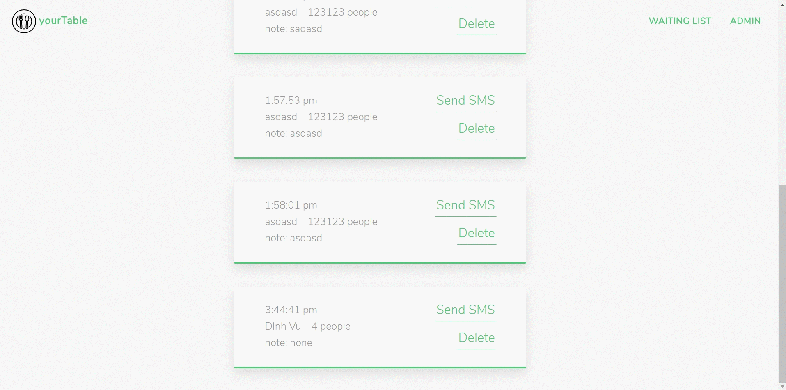

# yourTable | yourtime, your table
[![npm version]](https://img.shields.io/node/v/twilio?style=flat-square)[](https://travis-ci.org/badges/badgerbadgerbadger) 

A simple check-in web app that send the customer an sms message when their table is ready

## Getting Started
You need [Node.js](https://nodejs.org) installed on your machine. Simply download the installer from [nodejs.org](https://nodejs.org) and go through the installation steps.

### Installing

Navigate to the project forlder and run:

```
npm install
```

Start up the local server:

```
npm run start-dev
```
### Usage




## Deployment

Live demo-version is up on [Heroku](https://vu-yourtable.herokuapp.com/)

## Built With

* [express](https://expressjs.com/)
* [npm](https://www.npmjs.com/)
* [socket.io](https://socket.io/)
* [Twilio](https://www.twilio.com/)

## Authors

* **Dinh Vu** - *https://github.com/Ogger77*

## License

This project is licensed under the MIT License - see the [LICENSE.md](LICENSE.md) file for details


## Acknowledgments

* Icons made by [Pause08](https://www.flaticon.com/authors/pause08) from [Flaticon](https://www.flaticon.com/)
